# Candlestick Chart Analysis

* [Basic Candlestick](#basic-candlestick)
* [Basic Candlestick Patterns](#basic-candlestick-patterns)
    * [Spinning Top](#spinning-top)
    * [Doji](#doji)
        * [Doji Types](#doji-types)
* [Reversal Candlestick Patterns](#reversal-candlestick-patterns)
    * [Engulfing Pattern](#engulfing-pattern)
    * [Dark Cloud Cover](#dark-cloud-cover)
    * [Piercing Line](#piercing-line)
    * [Evening Star](#evening-star)
    * [Morning Star](#morning-star)
* [Continuation Candlestick Patterns](#continuation-candlestick-patterns)
    * [Rising and Falling Three](#rising-and-falling-three)
        * [Rising Three](#rising-three)
        * [Falling Three](#falling-three)
    * [Three White Solders](#three-white-soldiers)
        * [Advanced Block Pattern](#advanced-block-pattern)
        * [Stalled Pattern](#stalled-pattern)

## Basic Candlestick

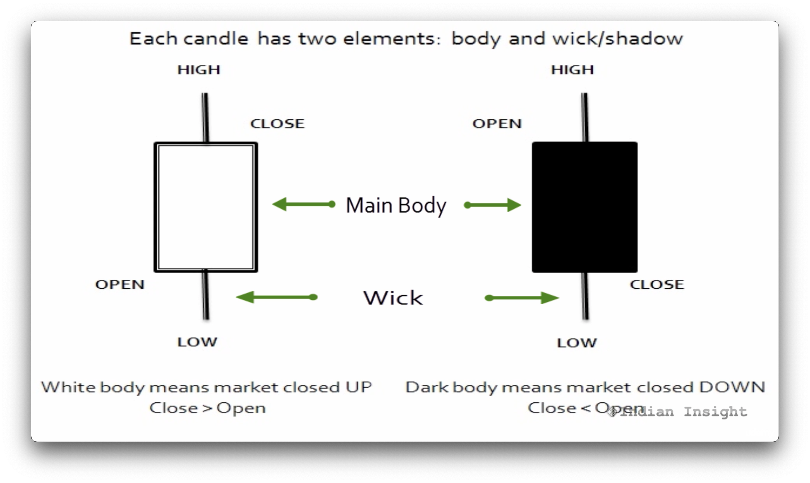

* **Period High** - The top bar
* **Period Low** - The bottom bar
* **Period open** - The bottom-left in an UP-close; the top-left in a DOWN-close
* **Period close** - The bottom-right in a DOWN-close; the top-right in an UP-close

* **Red/Black body** - Represents a DOWN-close (close < open); bearish period
* **White/Green/Other** - Represents an UP-close (close > open); bullish period

## Basic Candlestick Patterns

### Spinning Top

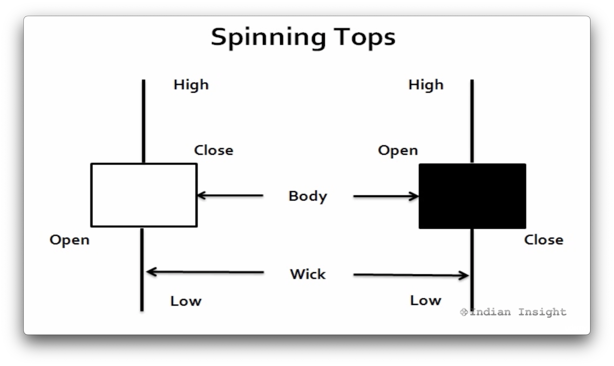

The spinning top pattern implies indecision in the market. Though there was some volatility in the trading, the close is very close to the open.

### Doji

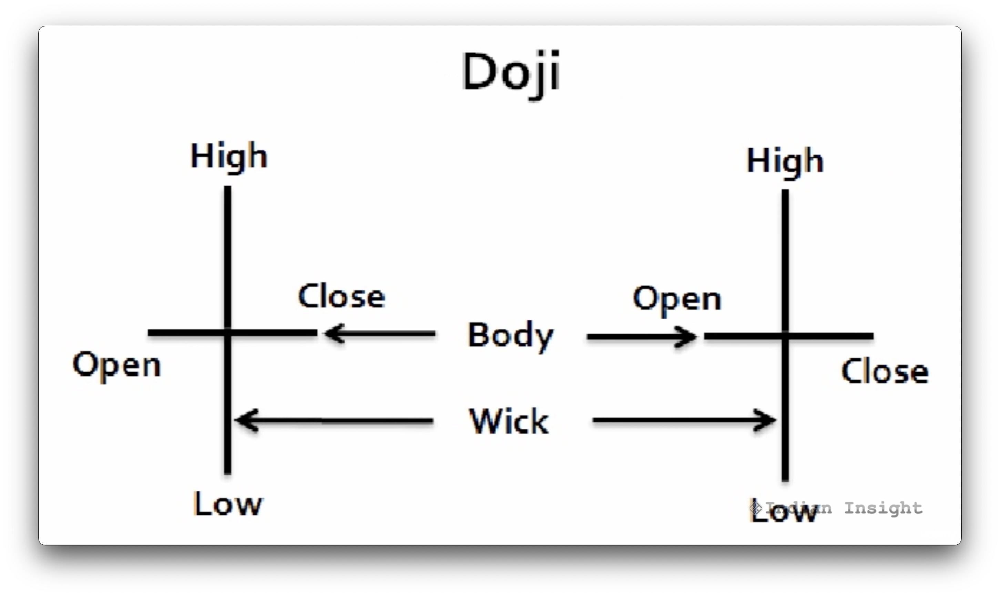

Open and close prices are the same.

#### Doji Types

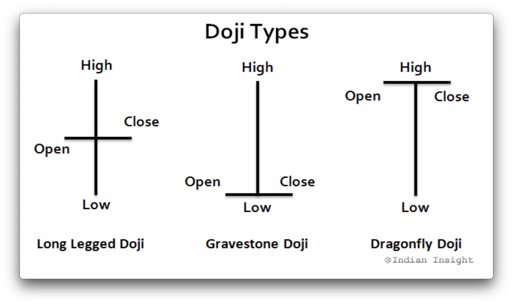

* **Long Legged Doji** - Implies indecision
* **Gravestone Doji** - Longer the top, the more bearish the implication as the closing price falls far below the high of the trading period.
* **Dragonfly Doji** - Longer the bottom, the more bullish the implications as the closing price falls far higher above the low of the trading period.

## Reversal Candlestick Patterns

Combination of _consecutive_ candlesticks appearing after an up-trend or a down-trend.
This combination indicated a reversal in trend. The trend before the occurrence of this pattern indicates what type of reversal this is.
These type of trends help us determine if there will be a reverse in trend.

* **Bullish reversal pattern** - valid only after a downturn (down-trend)
* **Bearish reversal pattern** - valid only after an upturn (up-trend)

### Engulfing Pattern

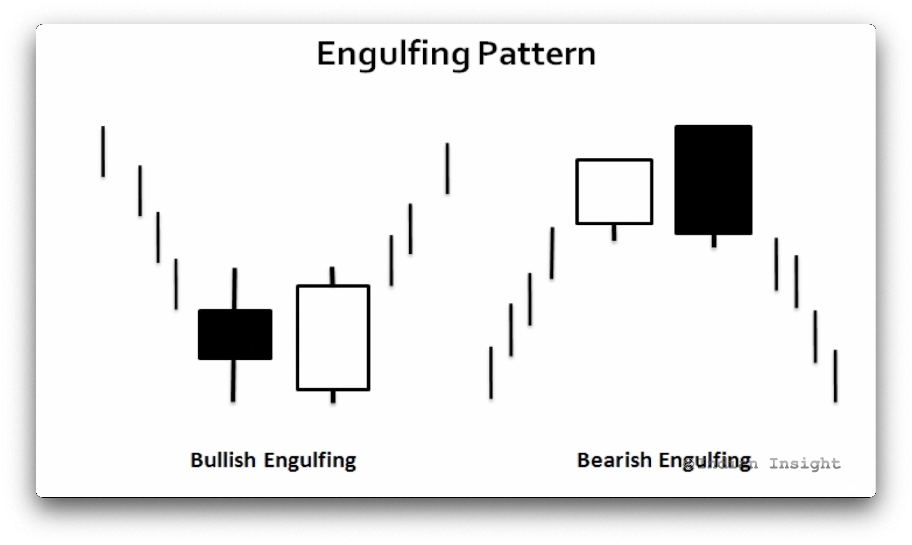

Consists of two candlesticks of different color

* **Bullish engulfing** - First stick is black, and next is white. This occurs after a downtrend. The white stick completely engulfs the black body. This indicates that the bulls have overtaken the bears, and an uptrend is expected.
* **Bearish engulfing** - First stick is white, and the next is black. This occurs after an uptrend. The black completely engulfs the white. This indicates that the bears have overtaken the bulls, and a downtrend is expected.

### Dark Cloud Cover

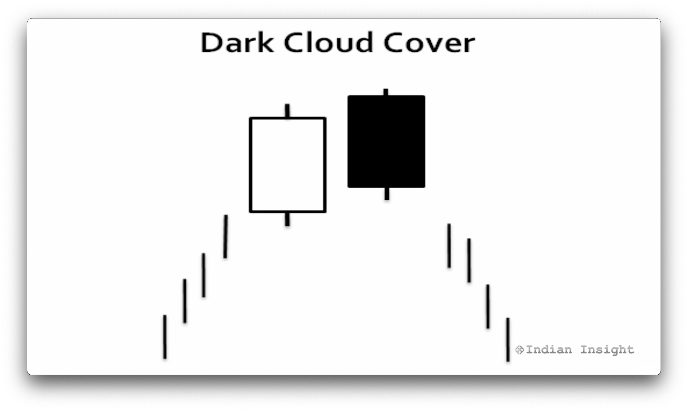

Has bearish implications and appears after an uptrend. The first day of the pattern is a long white stick, and the second day is a long black stick.
The white stick represents the uptrend of the first day, while the black stick represents the downtrend of the following day.
The open of the second day will be higher than the close of the previous day, adding the bullishness of the previous day, but then the close of the next day represents the bearishness and a reverse in uptrend.

### Piercing Line

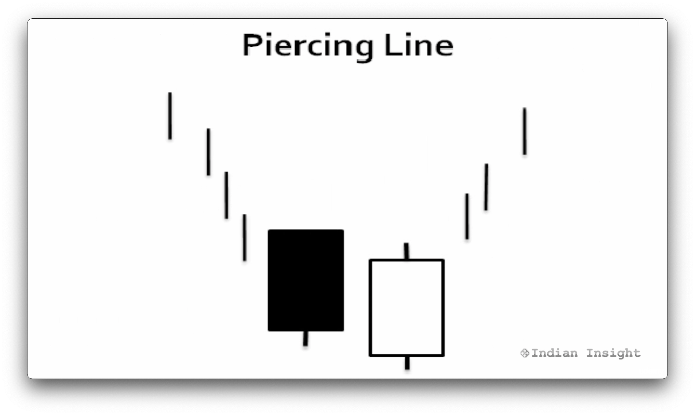

Has bullish implications and appears after a downtrend. The first day of the pattern is a long black stick followed by a long white stick.
The black stick represents the downtrend of the first day, while the white stick represents the uptrend of the following day.
The open of the second day will be lower than the close of the previous day, adding to the bearishness of the previous day, but then the close of the next day represents the bullishness and a reverse in downtrend.

### Evening Star

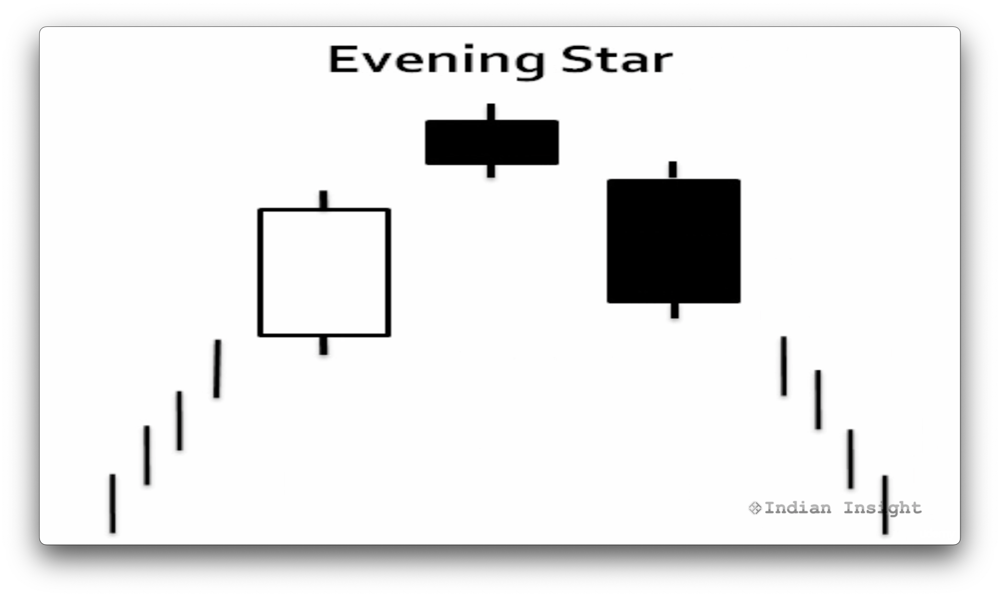

This pattern is represented by three days, and it comes after an uptrend. It represents a bearish reversal in trend.
The first day of the pattern is a bullish white candlestick.
The second day is traded above the first day but shows a small downturn. It's still above the first day.
The third day shows bearishness and closes well below the midpoint of first day.

### Morning Star

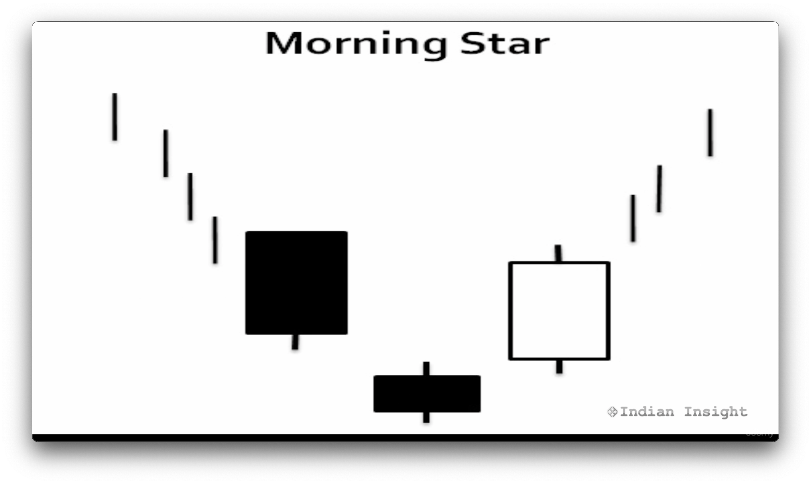

This pattern is represented by three days, and it comes after a downtrend. It represents a bullish reversal in trend.
The first day of the pattern is a bearish white candlestick.
The second day is traded below the first day and continues to show a small downturn.
The third day shows bullishness and closes above the midpoint of the first day.

## Continuation Candlestick Patterns

These type of trends help us determine if the trend is likely to continue. It signifies a period of rest for the market.

### Rising and Falling Three

The period of rest is signified in the middle and can sometimes be ignored. The period of rest can span more than the three days.

#### Rising Three

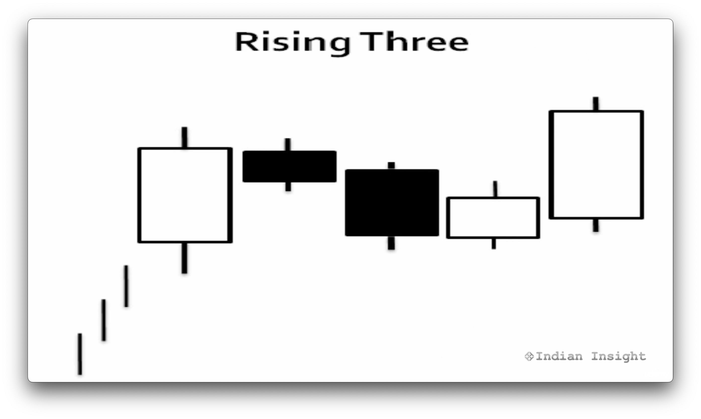

This pattern is only valid when it occurs after an uptrend. The first day of the pattern is a long white day.
The next three days show small changes but trend downward, but still remain within the range of the first long white day. At least two of the three are black bodies.
The three days are considered a period of rest, before the previous bullish trend resumes.
On the fifth day, the previous uptrend continues and creates a new high from the previous.

#### Falling Three

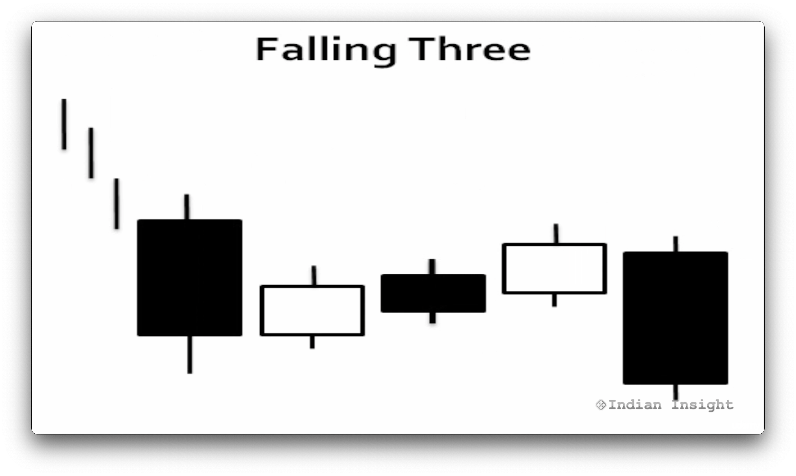

This pattern is only valid when it occurs after a downtrend. The first day of the pattern is a long black day.
The next three days show small change but trend upward, but still remain within the range of the first long black day. At least two of the three are white bodies.
The three days are considered a period of rest, before the previous bearish trend resumes.
On the fifth day, the previous downtrend continues and creates a new low from the previous.

### Three White Soldiers

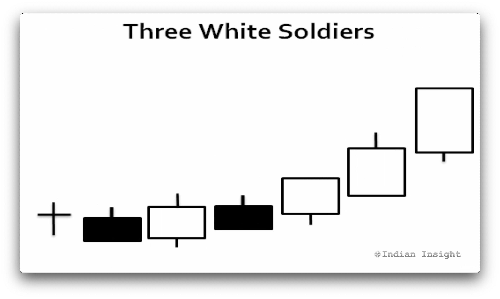

This pattern follows a period of rest and consists of three consecutive white bodies that increase in size each day. The close will be higher each day.
After a pretty stable period, this pattern indicates a strong price to come.
If the white bodies are too long, this may be an indicator that this is an over-bought market and one should take caution.
This pattern can sometimes be ignored, and the high pricing may not continue.

#### Advanced Block Pattern

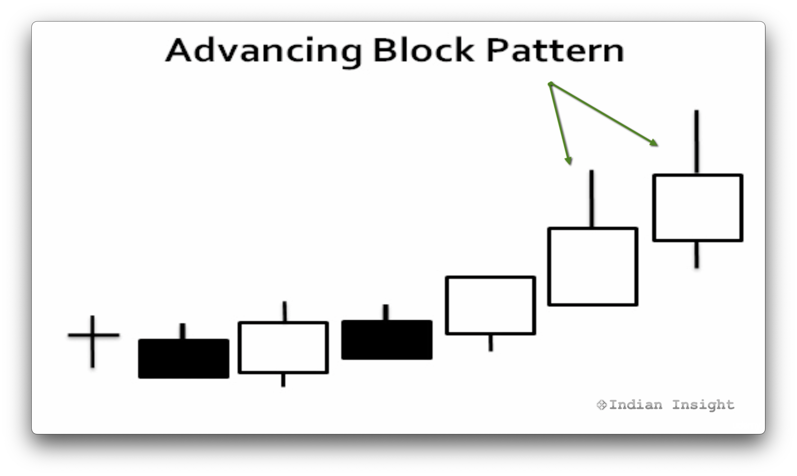

This looks similar to the Three White Soldiers but does not indicate a bullish market.
Here, the third candle is showing signs of weakening. The uptrend may be close to exhaustion.

#### Stalled Pattern

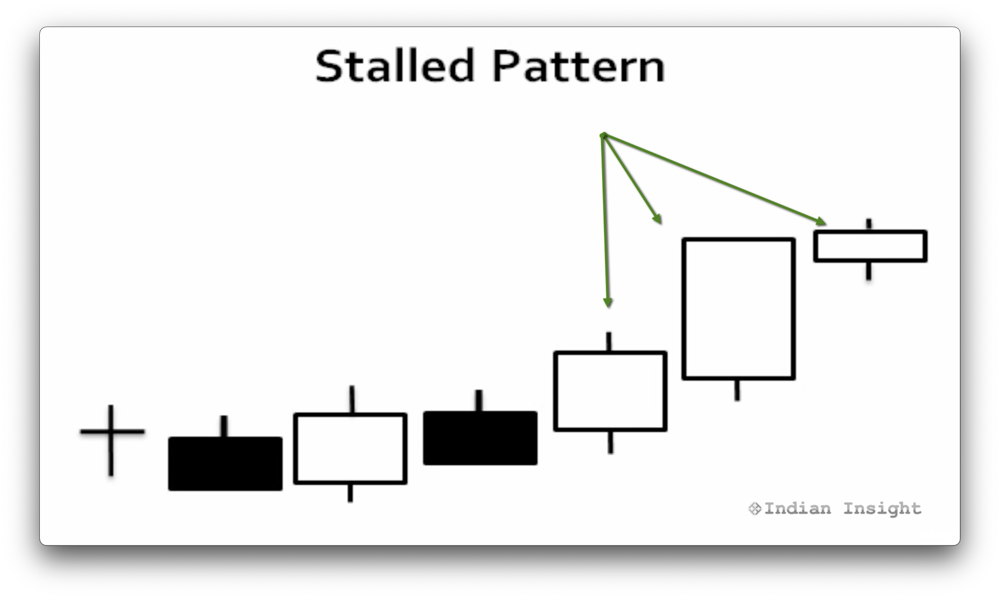

This also looks similar to the Three White Solders but also does not indicate a bullish market.
Here, there are two long white sticks, following by a smaller one. This uptrend may be coming to a close.
This might be a time to take your profits on a long position.