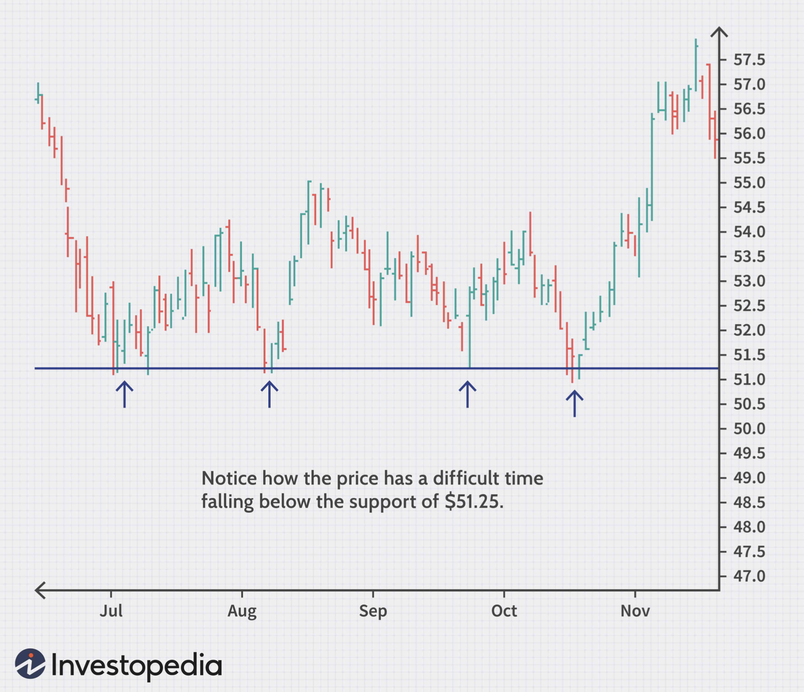

# Support and Resistance

[Source](https://www.investopedia.com/trading/support-and-resistance-basics/)

* [Introduction](#introduction)
* [Resistance](#resistance)
* [Support](#support)
* [Trendlines](#trendlines)
* [Round Numbers](#round-numbers)
* [Moving Averages](#moving-averages)
* [Fibonacci Retracement](#fibonacci-retracement)
* [Measuring the Significance of Zones](#measuring-the-significance-of-zones)
* [Bottom Line](#bottom-line)

## Introduction

Technical analysts use support and resistance levels to identify price points on a chart where the probabilities favor a pause or reversal of a prevailing trend.
Support and resistance are terms used by traders to refer to teh price levels on charts that tend to act as barriers, preventing the price of an asset from getting pushed in a certain direction.

* **Support** occurs when a downtrend is expected to pause due to a concentration of demand.
* **Resistance** occurs where an uptrend is expected to pause temporarily, due do concentration of supply.

Market psychology plays a major role as traders and investors remember the past and react to changing conditions to anticipate future market movement.
Support and resistance areas can be identified on charts using trendlines and moving averages.

Once an area or "zone" of support or resistance has been identified, those price levels can serve as potential entry or exit points because, as a price reaches a point of support or resistance, it will do one of two things -- bounce back away from the support or resistance level, or violate the price level and continue in its direction -- until it hits the next support or resistance level.

The timing of some trades is based on the belief that support and resistance zones will not be broken.
Whether the price is halted by the support or resistance level, or it breaks through, traders can "bet" on the direction and can quickly determine if they are correct.
If the price moves in the wrong direction, the position can be closed at a small loss.
If the price moves in the right direction, however, the move may be substantial.

>**Note:** Unlike the rational economic actors portrayed by financial models, real human traders and investors are emotional, make cognitive errors, and fall back on heuristics or shortcuts.
> If people were rational, support and resistance levels wouldn't work in practice.

## Resistance

In this case, there is a resistance level of $39. This represents a ceiling where the rally runs out of gas.
This may be a point to consider exiting a position

## Support

In this case, there is a support level of around $51-51.25. This represents a floor that prevents the price of an asset from being pushed downward.
The ability to identify a level of support can also coincide with a buying opportunity because this is generally the area where market participants see value and start to push prices higher again.

## Trendlines

The static barriers, in the examples above, are one of the most popular forms of support and resistance, but the price of financial assets generally trend upward or downward, so it is not uncommon to see these price barriers change over time.
This is why the concept of trending and trendlines are important.

When the market is trending upward, resistance levels are formed as the price action slows and starts to move back toward the trendline.
This occurs as a result of profit-taking or near-term uncertainty for a particular sector or issue.

Many traders will pay close attention to the price of a security as it falls toward the broader support of the trendline because, historically, this has been an area that has prevented the price of an asset from moving substantially lower.
In the example below, the trendline provided support for the asset for several years.

On the other hand, when the market is trending downward, traders will watch for a series of declining peaks and will attempt to connect these peaks together with a trendline. When the price approaches the trendline, most traders will watch for the asset to encounter selling pressure and may consider entering a short position because this is an area that has pushed the price downward in the past.

The support/resistance of an identified level, whether discovered with a trendline or through any other method, is deemed to be stronger the more times that the price has historically been unable to move beyond it.
Many technical traders will use their identified support and resistance levels to choose strategic enttry/exit points because these areas often represent the prices that are the most influential to an asset's direction.

## Round Numbers

Another common characteristic of support/resistance is that an asset's price may have a difficult time moving beyond a round number, such as $50 or $100 per share.
Most inexperienced traders tend to buy or sell assets when the price is at a whole number because they are more likely to feel that stock is fairly valued at such levels.
Most target prices or stop orders set by either retail investors or large investment banks are placed at round price levels rather than at prices such as $50.06.
Because so many orders are placed at the same level, these round numbers tend to act as strong price barriers.
If all the clients of an investment bank put in sell orders at a suggested target of, for example, $55, it would take an extreme number of purchases to absorb these sales and, therefore, a level of resistance would be created.

## Moving Averages

Most technical traders incorporate the power of various technical indicators, such as moving averages, to aid in predicting future short-term momentum, but these traders never fully realize the ability these tools have for identifying levels of support and resistance.
As you can see from the chart below, a moving average is a constantly changing line that smooths out past price data while also allowing the trader to identify support and resistance.
Notice how the price of the asset finds support at the moving average when the trend is up, and how it acts as resistance when the trend is down.

Traders can use moving averages in a variety of ways, such as to anticipate moves to the upside when price lines cross above a key moving average, or to exit trades when the price drops below a moving average.
Regardless of how the moving average is used, it often creates "automatic" support and resistance levels.
Most traders will experiment with different time periods in their moving averages so that they can find the one that works best for this specific task.

## Fibonacci Retracement

The Fibonacci retracement tool is a favorite among many short-term traders because it clearly identifies levels of potential support/resistance.
Notice in the figure below how the identified levels (dotted lines) are barriers to the short-term direction of the price.

## Measuring the Significance of Zones

The security can be viewed as a rubber ball that bounces in a room. It will hit the floor (support) and then rebound off the ceiling (resistance).
A ball that continues to bounce between the floor and the ceiling is similar to a trading instrument that is experiencing price consolidation between support and resistance zones.

Now imagine that the ball, in mid-flight, changes to a bowling ball.
This extra force, if applied on the way up, will push the ball through the resistance level; on the way down, it will push the ball through the support level.
Either way, extra force, or enthusiasm from either the bulls or bears, is needed to break through the support or resistance.

A previous support level will sometimes become a resistance level when the price attempts to move back up, and conversely, a resistance level will become a support level as the price temporarily falls back.

Price charts allow traders and investors to visually identify areas of support and resistance, and they give clues regarding the significance of these price levels. More specifically, they look at:

**Number of Touches**  
The more times the price tests a support or resistance area, the more significant the level becomes. When prices keep bouncing off a support or resistance level, more buyers and sellers notice and will base trading decisions on these levels.

**Preceding Price Move**  
Support and resistance zones are likely to be more significant when they are preceded by steep advances or declines.
For example, a fast, steep advance or uptrend will be met with more competition and enthusiasm and may be halted by a more significant resistance level than a slow, steady advance. A slow advance may not attract as much attention.
This is a good example of how market psychology drives technical indicators.

**Volume at Certain Price Levels**  
The more buying and selling that has occurred at a particular price level, the stronger the support or resistance level is likely to be.
This is because traders and investors remember these price levels and are apt to use them again.
When strong activity occurs on high volume and the price drops, a lot of selling will likely occur when price returns to that level, since people are far more comfortable closing out a trade at the breakeven point rather than at a loss.

**Time**  
Support and resistance zones become more significant if the levels have been tested regularly over an extended period of time.

## Bottom Line

Determining future levels of support can drastically improve the returns of a short-term investing strategy because it gives traders an accurate picture of what price levels should prop up the price of a given security in the event of a correction.
Conversely, foreseeing a level of resistance can be advantageous because this is a price level that could potentially harm a long position, signifying an area where investors have a high willingness to sell the security.

>**Note:** While spotting support and resistance levels on a chart is relatively straightforward, some investors dismiss them entirely because the levels are based on past price moves, offering no real information about what will happen in the future.